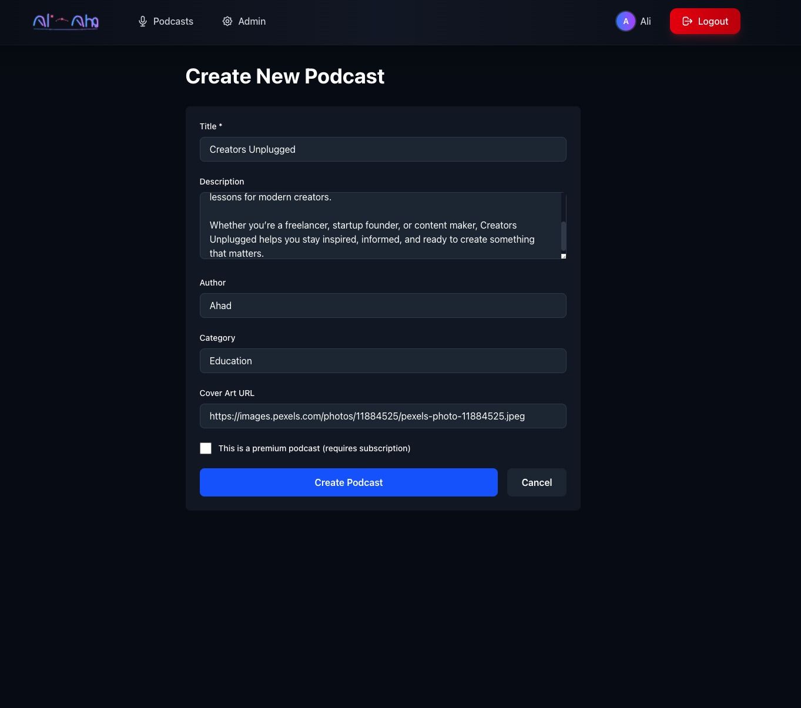
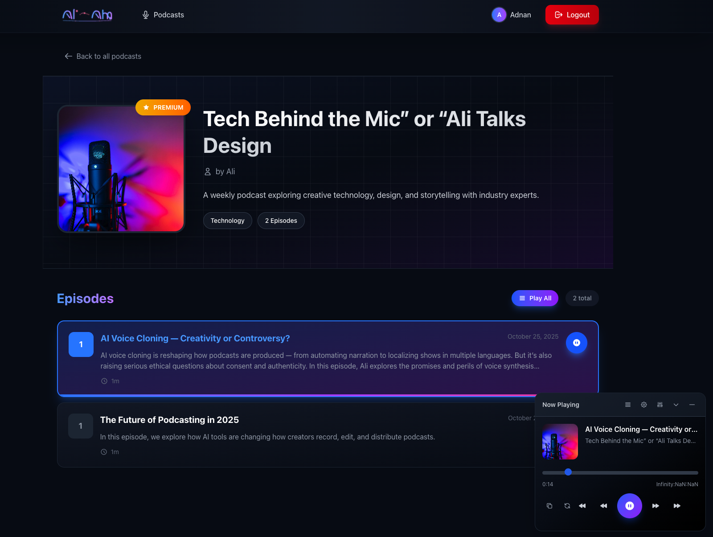

# 🎧 PodcastApp
### Premium-first podcast platform for creators who want recurring revenue and real-time fan engagement.

---

## Why Clients Love It

- **Subscription Revenue on Autopilot** – Monetize premium seasons, bonus drops, and backstage live shows with Stripe-powered plans (monthly + yearly).
- **Live Broadcast Studio** – Go live on Cloudflare Stream, interact in real time, and auto-publish the replay as a polished episode when you sign off.
- **Beautiful Listener Experience** – High-end audio player, progress sync across devices, curated discovery, and a floating global player that’s always a click away.
- **Built for Growth** – Capture emails, nurture subscribers with transactional SMTP flows, and surface insights with a dedicated analytics dashboard.

---

## Spotlight Features

### 🎙️ For Listeners
- One-tap access to free & premium catalogues
- Personal progress sync + resume listening
- Floating player with queue, skip, speed, and keyboard shortcuts
- Premium live events and replays gated to paying members

### 🛠️ For Creators & Teams
- Admin studio for podcasts, episodes, and live sessions
- Drag-and-drop audio uploads to Cloudflare R2
- Stripe billing portal for subscribers to self-manage plans
- Live event scheduling, RTMPS credentials, and automatic replay publishing
- Real-time analytics (subscribers, plays, premium mix)

### ⚙️ Stack Clients Appreciate
- **Frontend:** Next.js 15 (App Router), React 19, Tailwind CSS 4
- **Edge & Infra:** Cloudflare Workers, D1 (SQLite on the edge), R2 Storage, Stream Live
- **Auth & Email:** JWT auth with secure password reset, SMTP (Hostinger ready)
- **Payments:** Stripe subscriptions + customer portal (no webhooks required for activation)

---

## Quick Tour

| Experience | What’s Included |
|------------|-----------------|
| **Home & Discovery** | Premium-first marketing site with testimonials, pricing bands, and curated collections |
| **Podcast Detail** | Episode lists with premium gating, instant queueing, and high-res cover art |
| **Live Lounge** | Listing of upcoming + live shows with paywall awareness, tokenized playback |
| **Listener Profile** | Subscription status, billing actions, playback history |
| **Admin HQ** | Content management, analytics, live control room with Stream credentials |

---

## Visual Tour

<table>
  <tr>
    <td align="center"></td>
    <td align="center"></td>
    <td align="center"></td>
  </tr>
  <tr>
    <td align="center"></td>
    <td align="center"></td>
    <td align="center"></td>
  </tr>
  <tr>
    <td align="center"></td>
    <td align="center"></td>
    <td align="center"></td>
  </tr>
</table>

---

## Launch Playbook

1. **Drop in brand assets** (logo, hero copy, pricing tiers).
2. **Configure Stripe & SMTP** for real transactions and email workflows.
3. **Connect Cloudflare Stream** to unlock live broadcasts and automatic episode replays.
4. **Invite creators** to upload seasons, schedule live events, and launch premium plans.
5. **Promote** – share the landing page, tease exclusive drops, and drive subscribers.

> ⚙️ Need the developer setup and deployment steps? See **[SETUP.md](SETUP.md)** for the full engineering runbook (env vars, D1 migrations, Stream config, etc.).

---

## Success Checklist

- [ ] Stripe plans mapped to your real prices  
- [ ] SMTP sender verified (welcome, reset, subscription emails)  
- [ ] Cloudflare Stream webhook secret configured for automatic replay uploads  
- [ ] Admin account promoted via D1 command line  
- [ ] Premium content tagged and tested with a sandbox subscriber  

---

## Ready to Ship?

Deploy straight to Cloudflare’s global edge with a single command, or let us package it for your client with custom branding, curated playlists, and growth-ready automations.

**Let’s launch a premium podcast experience your audience will rave about.**  
Need help tailoring it to your client? We’re a DM away. 🚀
